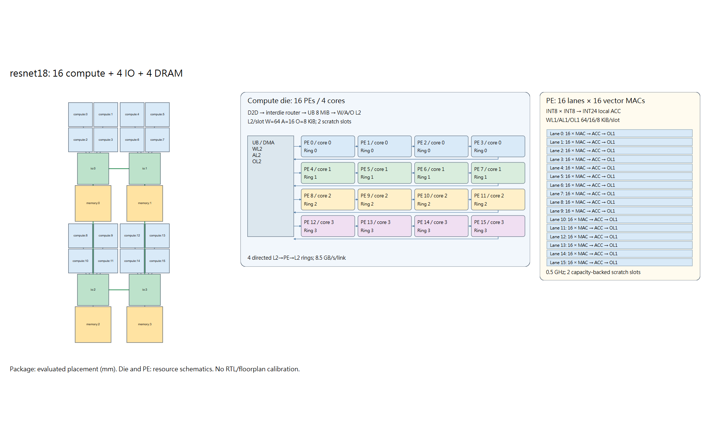
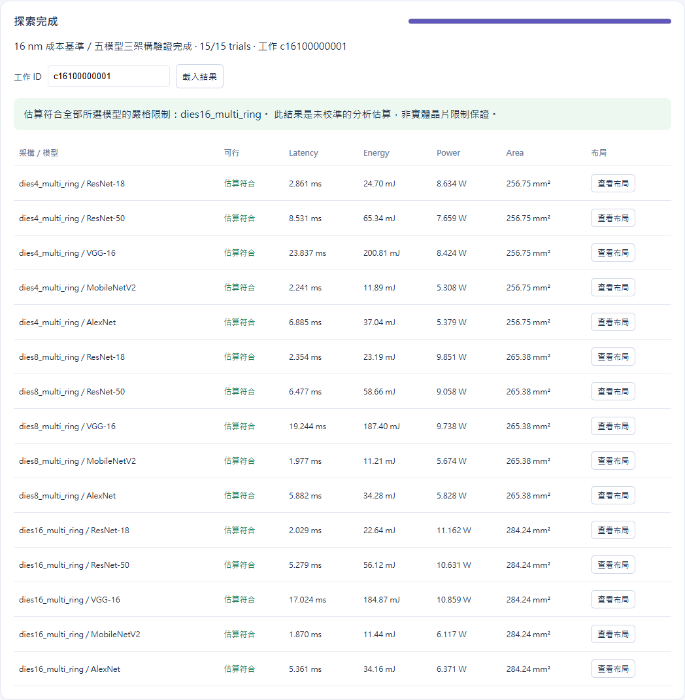

# INDM＋Gemini Chiplet DSE — 10/09

以 **INDM 的 I/O cluster mesh／片內 multi-ring** 結合 **Gemini 的 layer pipeline／mapping operators**，保留 RL 搜尋，透過原生 RapidChiplet 與 workload-aware 評估器計算 PPA。此版本使用 `literature16_v1` 文獻參考成本模型，並提供 GUI、逐項 strict／soft PPA 限制與 closest fallback。



## 先看這些

- [最新完整 PDF 報告](reports/2026-10-09/cost16_report.pdf)
- [硬體參數來源、單位與假設](docs/hybrid_cost16_sources.md)
- [15 組實驗與敏感度驗證](docs/hybrid_cost16_validation.md)
- [PPA CSV](reports/2026-10-09/ppa.csv)
- [發布與重現說明](docs/publication.md)

## 安裝與執行

建議 Python 3.11。從 repository 根目錄執行；完整模型使用 CPU 版 Torch／torchvision，不下載 pretrained weights。

```powershell
python -m venv .venv
.venv/Scripts/python.exe -m pip install -r requirements.txt
.venv/Scripts/python.exe tools/setup_rapidchiplet.py
.venv/Scripts/python.exe tools/import_reference_results.py
.venv/Scripts/python.exe -X utf8 simplified_rapidchiplet/hybrid_gui.py --out simplified_rapidchiplet/results/hybrid_gui_cost16
```

開啟 **http://127.0.0.1:8765**。可輸入工作 ID **`c16100000001`** 載入已完成的 15 組參考實驗；或在 GUI 建立新工作。PowerShell 也可使用 `simplified_rapidchiplet/scripts/start_hybrid_gui.ps1`。

Linux／macOS 將 `.venv/Scripts/python.exe` 改為 `.venv/bin/python`。原生 RapidChiplet 由 setup script 下載至 `external/rapidchiplet` 並鎖定 commit；本專案 analytical backend 不需要編譯 BookSim。已有 RapidChiplet 者可在啟動前設定環境變數 `RAPIDCHIPLET_ROOT`，CLI 亦提供 `--rapid-root`。

## GUI 與搜尋

- 四種偏好：均衡、低功耗、小面積、低延遲；每項 PPA 數值可獨立啟用並勾選 strict。
- 支援 ResNet-18／34／50、VGG-16／19、AlexNet、MobileNetV2，以及快速 toy 範例。
- 搜尋 compute die 數、互連與 mapping；Gemini 風格的五類 operator、layer pipeline、prefetch、dataflow／SRAM reuse 與 layer-switching traffic 一起評估。
- 多模型共同推薦一種硬體；找不到符合所有 strict 上限的候選時，提供 closest 方案與超標差距。物理容量或 mapping 錯誤不能放寬。
- 每次執行輸出實際 `hardware.json`、`mapping.json`、timeline、PPA，以及按實際 die／PE 數量繪製的互動 layout 和 SVG 圖。



快速 CLI 範例：

```powershell
.venv/Scripts/python.exe -X utf8 simplified_rapidchiplet/hybrid_dse.py --model toy --mode search --method rl --budget 4 --seed 7 --out simplified_rapidchiplet/results/demo
```

## 成本與驗證範圍

最新基準：4／8／16 compute dies，各使用總 UB 128 MiB、256 PEs、500 MHz、L1／L2 雙緩衝；五種完整 224×224、batch 1 CNN 共 **15 組**。另有 60 次完整 oracle 敏感度評估與 165 次成本 ledger 重算。新成本模型修正 MAC ×8 的誤讀，按 SRAM bank 與完整 GRS endpoint 計價。詳細依據與未校準參數請看來源文件。

Power 為平均推論功率（energy / batch latency）；Area 為總 silicon area；Latency 為指定 batch 的 makespan。這是文獻與明確假設組成的分析模型，PPA compliant 是模型內判斷；尚未完成實體晶片 signoff。四種偏好不代表 RL 已優於所有其他搜尋方法；目前搜尋預算也不構成全域最優證明。

測試：

```powershell
Set-Location simplified_rapidchiplet
../.venv/Scripts/python.exe -X utf8 -m unittest discover -s tests -v
```

發布副本重新執行 **166 tests**；原始參考資料的測試紀錄保存在 `reports/2026-10-09/original_test_log.txt`。發布驗證紀錄見 `reports/2026-10-09/publication_validation.json`。

## 目錄

| 路徑 | 內容 |
| --- | --- |
| `simplified_rapidchiplet/simple_rapidchiplet/hybrid/` | 目前硬體、mapping、RL、pipeline、通訊與成本評估 |
| `simplified_rapidchiplet/hybrid_dse.py`、`hybrid_gui.py`、`gui/` | CLI 與 GUI |
| `simplified_rapidchiplet/tests/`、`configs/` | 驗證與設定 |
| `docs/` | 架構、方法、來源與成本驗證 |
| `tools/` | 安裝原生依賴、匯入參考結果、重跑基準與敏感度 |
| `reports/2026-10-09/` | PDF、圖、CSV 與可追溯參考資料壓縮檔 |

`simple_rapidchiplet/` 中 hybrid 以外模組與 `run.py`／`preference_dse.py` 為保留的早期研究程式；目前使用上面的 hybrid 入口。歷史成本值請勿與 `literature16_v1` 混用。

參考來源：[RapidChiplet](https://github.com/spcl/rapidchiplet)、[Gemini 原始實作](https://github.com/SET-Scheduling-Project/GEMINI-HPCA2024)。INDM、Gemini、NN-Baton、GRS 的對應成本與方法引用詳見 sources 文件。第三方程式保留於外部依賴，這份 repository 不替第三方新增授權。
