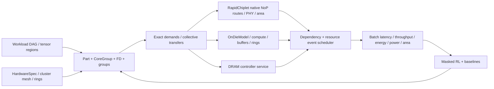

> 更新：使用者最新的16nm成本基準與strict/soft限制修正，請先看 [hybrid_cost16_sources.md](hybrid_cost16_sources.md) 與 [hybrid_cost16_progress.md](hybrid_cost16_progress.md)。本檔下方數值屬歷史版本；舊混合製程／MAC乘8推導已撤回，不可當成新成本。

# INDM + Gemini + RL：融合架構與實作契約

2026-10-09更新：使用者追加的多模型／GUI／片內dataflow／付費prefetch設計與驗證，見 `hybrid_oct09_architecture.md` 及 `hybrid_oct09_progress.md`。本檔下方描述保留為10/06 baseline；其中「宏unit串接」、「只支援ResNet50」、「沒有GUI」等限制已有可選新實作。

本設計依2026-10-05使用者的新目標建立。INDM/Gemini 論文與下載的C++程式是方法及參數來源；以本專案的可執行實作與驗證為交付。

## 晶片與資源

Package 使用cluster mesh：IO dies為mesh路由節點；每cluster至多四顆compute dies與一個DRAM endpoint。Compute/DRAM為leaves，跨cluster資料經IO，DRAM controller/crossbar及GRS PHY都有容量、成本與能耗。預設16-die profile每compute die提供16個PE；PE內16 lanes×16 size的INT8 vector MAC，輸入C維度的分塊累積留在PE，不跨chiplet做partial sum。

預設16-compute-die profile每die提供四個mapping core slots，每slot四個PE、1024 MAC/cycle。這是融合設計的mapping粒度，不把die、core、PE當成同一件事。Core ID為`compute:0/core:0`；實際package die ID為`compute:0`；IO/DRAM為`io:0`/`memory:0`。

片內採四PE對應的單向ring資源、WL/AL/OL L1/L2。另加每die2MiB unified buffer支援Gemini的GLB與pipeline residency；這是融合extension，所有SRAM需付出面積、leakage與讀寫能量。預設1GHz、INT8 activation/weight、24-bit psum；NoP參考100Gb/s、NoC參考68Gb/s；DRAM總頻寬參考600Gb/s，再分配給各cluster。所有參考與近似係數在HardwareSpec與報告揭露。

建立iso-total-compute/resource候選：4/8/16 compute dies，總64 mapping cores與相同總PE/MAC及unified SRAM。每diecore/PE數依granularity改變；IO、PHY、package geometry成本重新導出。Architecture探索不免費改硬體。

| 資源 | 預設16-die reference | ResNet batch8容量配置 |
|---|---|---|
| Package | 2×2 IO mesh，16 compute + 4 IO + 4 DRAM | 相同 |
| Compute | 16 PE/die；16 lanes×16 INT8 MAC/PE；1GHz | 相同 |
| Mapping | 4 cores/die；4 PE/core；總64 cores | 相同 |
| Peak算力 | 65,536 MAC/cycle，65.536 TMAC/s，131.072 decimal TOPS | 相同 |
| PE L1 W/A/O | 每PE64/16/8KiB，總22MiB | 相同 |
| Die L2 W/A/O | 每die64/16/8KiB，總1.375MiB | 相同 |
| Unified SRAM | 每die2MiB，總32MiB | 每die4MiB，總64MiB |
| 片內 | 4個4-PE單向ring/die；每link8.5GB/s | 相同 |
| 片間 | GRS每direction/link12.5GB/s；額外受bump ceiling限制 | 相同signaling，placement/線長重算 |
| DRAM | 每cluster2GiB、18.75GB/s；總8GiB、75GB/s | 相同 |
| 其他service | IO crossbar50GB/s；每PE L1 port64GB/s；die L2/UB各64GB/s | 相同 |
| Precision | activation/weight INT8；partial sum INT24 | 相同 |

4MiB配置是合法batch8 pipeline的明示SRAM擴充，不屬於32MiB iso-total候選。容量驗證發現同一個g3 mapping需要3,682,912B/die，2MiB不合法；4MiB付出silicon25.8772mm²與idle0.52624W的增量，包含SRAM及新placement影響。詳細結果見 [hybrid_validation.md](hybrid_validation.md)。

| Iso-total候選 | IO/DRAM數 | PE/die | Cores/die | Rings/die | UB/die |
|---|---:|---:|---:|---:|---:|
| 4 compute dies | 1/1 | 64 | 16 | 16 | 8MiB |
| 8 compute dies | 2/2 | 32 | 8 | 8 | 4MiB |
| 16 compute dies | 4/4 | 16 | 4 | 4 | 2MiB |

每個候選也可切換片內mesh作對照。L1總量、L2總量、DRAM容量/總頻寬守恆；跨die鏈路數、IO/PHY成本與聚合網路頻寬隨實體partition改變。共享L2/UB的總服務率為256/512/1024GB/s，IO crossbar為50/100/200GB/s，均隨實體複製數改變，不屬於守恆項。讓topology follow communication pattern的本次實作，是外層比較這些有成本的architecture，再在各自幾何上找mapping；不包含RL任意增加或移除實體link的action。

## Mapping 與 RL

Gemini layer encoding使用`Part=(B,K,H,W)`、ordered core group、input/weight/output DRAM selector。Tuple order明示轉換；分割維度是output，所有input halo、weight region及residual依賴由layer語意導出。Partition cardinality必須等於core group大小，沒有空shards。

Layer groups明示spatial/temporal；spatial group內不同layers使用互斥cores，在不同microbatches之間pipeline。Group boundary有DRAM write/read，same-group直接傳輸與reuse。Batch 1保留fill/drain；完整DAG的共享祖先不重算。Layer grouping、microbatch規劃是獨立上層選擇，不是Gemini五operators之一。

五個RL action family：OP1合法partition變更；OP2單layer ordered cores swap；OP3同spatial group跨layer core swap；OP4移轉core並重選兩layers partition；OP5合法DRAM/interleave變更。以有state/action特徵的learned actor-critic policy選具體family與operands，mask非法操作；保存policy、value、RNG、current/best plan、objective scales與history，支援resume。OP4另外明示hybrid idle-pool acquire/release與nearest-legal resize extension：可啟用未分配core，並跨過無合法整數partition的cardinality，避免48→47的prime因子障礙。這些extension共享給全部baseline，不冒稱Gemini原始操作。

Cluster-aware traffic proposals是本專案extension：以重producer-consumer需求與資源pressure生成候選，不強制layer compact placement，也不以人工ring efficiency當reward。和無偏proposals分別ablate。

實際DSE流程為：先選外層hardware candidate；bounded beam提出topological graph cuts及合法microbatch；balanced allocator以整數SIMD與UB壓力生成Part/CG/FD；完整oracle選可行初始plan；masked actor-critic再從五operators與明示extensions選mapping變更。初始proposal使用估计剪枝，最終reward與ranking使用完整batch PPA。硬體候選比較raw EDP或共同area/power加權目標；每個mapping search則固定初始physical EDP作normalization，不能把各自相對值混用於選硬體。

RL是numpy實作的線性actor-critic，有state/action features、可學習actor/value參數與policy updates；目前沒有GNN或跨模型預訓練。State涵蓋layer/dependency/mapping、真實die/memory位置、package鏈路/IO/DMA壓力；NoC成本進入總latency/energy，但policy state尚未逐ring讀取壅塞。三seed同預算結果顯示可改進initial mapping，尚不能宣稱比greedy更好。

## 評估分工

Adapter用HardwareSpec產生原生inputs與合法cluster XY routes，RapidChiplet提供path-latency公式、bump-derived頻寬上限，以及本專案dimensions/placement/idle-power inputs的native silicon/package area與power聚合；SRAM/MAC面積和leakage係數由本專案未校準profile提供。實際鏈路額外受明示PHY/DDR頻寬限制。Compute/NoC/memory/mapping-sensitive energy由本專案補足。Native idle power與dynamic operation energy分開，避免重複計算；未實作Gemini的yield/製造金額成本模型。

所有traffic從同一CommunicationPlan推導：logical bytes、source injection、NoP hop bytes、NoC bytes分開。Multicast共享prefix只傳一次；不同tensor/region不能合併成免費broadcast。Weights有cold/cache政策，cache必須有容量與第一次load。

Scheduler有compute core、directed NoP links、NoC/ring、IO crossbar與memory controller資源；每個job依賴tensor producer/transfer，排入資源日曆，保留fill/drain、微批次與跨group barrier。採可擴展的deterministic priority list scheduling，依group/MB/layer及依賴把job放入共用資源日曆空隙；不宣稱最優排程。每core宏unit的read/compute/write串接，避免無限量L1預取；其他cores仍可重疊。片內單向ring使用actual directededges，mesh使用XY，兩者資料需求相同。

AL/WL/OL L1/L2有獨立bank容量，內部B/K/H/W/C microkernel和bounded LRU導出refill流量；INT24 partialsum需留在容量足夠的OL1。L1 bandwidth取最忙PE，而非不均勻shards的平均。Full received regions占UB直到消費unit完成，作bank refill的backing；persistent weights只重用exact-region copy且保留到最後reader，初次DRAM load及容量都計入。DRAM也檢查weights/input/boundary/output live residency。超容量候選reject，沒有隱藏免費spill或Ctiling折扣。

On-die microkernel投影為宏read/compute/write服務成本，不是先把整個macro填進L1；不提供微kernelstreaming細粒度overlap credit。片外multicast以union directededges atomic service建模，不含packetVC/arbitration。這些是可檢查的分析近似；目前未經RTL或silicon校準，不能稱cycle accurate。

Dynamic energy計MAC、SRAM、DRAM、NoC、NoP操作；static energy=idle power×makespan。報告batch makespan、first-result latency、samples/s、batch energy、energy/sample、average power、compute/IO/memory/total silicon與package footprint。Whole-batch EDP使用total energy×makespan，不相加local EDP。

`HardwareSpec.provenance`部分字串描述default profile（2MiB、four cores、four clusters）的來源，並非每個variant的當前數量；實際配置以輸出的numeric hardware/resources欄位為準。這項metadata限制不改變variant的資源、area或timing計算。

## API 與模組責任

- `hardware.py`: HardwareSpec、build_package；一致资源/成本/端點/PHY allocation。
- `rapid_backend.py`: evaluate_package、all-pairs typed routes、effective/native bandwidth、latency與area/provenance。
- `workload.py`: workload/tensor/layer DAG、INT8 shape frontend、toy與ResNet50。
- `mapping.py`: Partition/LayerMapping/LayerGroup/MappingPlan、合法性、initial_mapping、compile_mapping成exact WorkUnits。
- `communication.py`: exact tensor需求、DRAM spill/read、weights、multicast/unicast、unit dependencies。
- `ondie.py`: core MAC/elementwise cycles、buffer/ring traffic及energy。
- `scheduler.py`: 資源與依賴排程、可檢查時間線。
- `evaluator.py`: 統一metrics、capacity/traffic/energy證據、固定identity cache。
- `actions.py`/`search.py`: 五operator、masked learnable policy、resume、公平random/greedy/SA baseline。
- CLI/report/validation: architecture候選、group/batch候選、toy/ResNet runs、machine-readable結果與使用方式。

## 驗收

硬體變更資源成本連動；無重疊/重複PHY；typed routes正確；partition output/MAC守恆；halo、grouped/depthwise、residual需求完整；multicast節省來源注入而不缺資料；DRAM來源/寫回selector生效；core/resource不能超額同時使用；pipeline batch1無虛構speedup、batch多sample有fill/drain；SRAM容量影響可行性；area/power/energy來源清楚；checkpoint/resume與連續run一致；同budget/seed對照RL與簡單baseline，不預設RL一定勝出。
